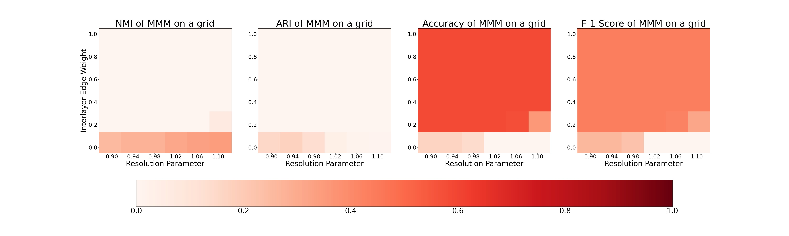

Dynamic Community Detection(DCD)
=================================

Once we have a set of n by n adjacency matrices for a temporal network with T many snapshots, we can create a ``temporal_network`` object. One can input either a list of adjacency matrices, an edge list or, a supra-adjacency matrix in order to construct the temporal network.

.. code-block:: python
    size = n
    length = T
    #omega = interlayer edge weights
    #kind = interlayer coupling
    TN = temporal_network(size, length, window_size, data = 'list__adjacency', list_adjacency = adjacency_matrices, omega = 1, kind = 'ordinal')
    
Skeleton coupling
*************************
    
The API is designed to perform a GridSearch on the parameter spaces of algorithms. For example, if one is utilizing skeleton coupling Multilayer Modularity Maximization, then you can provide a range of values for resolutions parameter and interlayer edge weights. Note that by default, interlayer coupling will be uniform diagonal.

    
.. code-block:: python

    interlayer_edge_weights = np.linspace(0, 1, 6)
    resolutions_parameters = np.linspace(0.9, 1.1, 6)
    
    partitions, C = TN.run_community_detection(method = 'MMM', ## modularity maximization
                                           update_method = 'skeleton', ## skeleton coupling
                                           interlayers = interlayer_edge_weights, #gridsearch parameters1
                                           resolutions = resolution_parameters, #gridsearch parameters2
                                           spikes = spikes) # Spike train
                                           
Alternatively, if one wants to use skeleton coupling with Infomap, below is an example code. Note that, if one wants to test a single parameter, they need to pass an array-like for the GridSearch to run properly.
                                           
.. code-block:: python

    interlayer_edge_weights = [0.2]
    edge_thresholds = [0.5]
    
    thresholded_adjacency_matrices = []
    #we need to build a new temporal network object in which edge weights are thresholded
    for i in range(layers):
        thresholded_adjacency_matrices.append(threshold(adjacency_matrices[i],edge_thresholds[0]))
    
    TN_thresholded = temporal_network(size, length, window_size, data = 'list__adjacency', list_adjacency = thresholded_adjacency_matrices, omega = 1, kind = 'ordinal')
    
    pred_partitions, C = TN_thresholded.run_community_detection(method = 'Infomap', ## modularity maximization
                                           update_method = 'skeleton', ## skeleton coupling
                                           interlayers = interlayer_edge_weights, #gridsearch parameters1
                                           thresholds = edge_thresholds, #gridsearch parameters2
                                           spikes = spikes) # Spike train
                                           
In general, below code returns a dictionary whose values are accessed by ``'%d,%d'%(t,node)`` where :math:`0<=t<=T_{max}-1` is the layer id in which a ``node`` is belong to and :math:`node` is the node id. Each value is a list of nodes (or an empty list) indicating the skeleton coupling assignment of the ``node`` in snaphot ``t``.

.. code-block:: python

    membership_static = TN.infomap_static(adjacency_matrices)
    bridge_links = TN.find_skeleton(membership_static)
    
    membership_static = TN.MMM_static()
    bridge_links = TN.find_skeleton(membership_static)
    
Refer to the supplementary material of the paper for the psedocode computing skeleton coupling edges.

Computing partition quality
******************************

Once we found predicted partitions, we can compare them with the ground truth to compute accuracy of the algorithms on a grid of parameters. For example, one can compute normalized mutual information (NMI), adjusted rand index (ARI), accuracy and F1-scores.

.. code-block:: python

    NMI_mmm = np.zeros((len(interlayers), len(resolutions)))
    ARI_mmm = np.zeros((len(interlayers), len(resolutions)))
    ACC_mmm = np.zeros((len(interlayers), len(resolutions)))
    F1S_mmm = np.zeros((len(interlayers), len(resolutions)))

    true_labels = generate_ground_truth(comm_sizes, community_operation = 'grow')

    for i, e in enumerate(interlayers):
        for j, f in enumerate(resolutions):
            NMI_mmm[i][j] = normalized_mutual_info_score(true_labels, list(C[i*len(resolutions)+j].astype(int)))
            ARI_mmm[i][j] = adjusted_rand_score(true_labels, list(C[i*len(resolutions)+j].astype(int)))
            F1S_mmm[i][j] = f1_score(true_labels, list(C[i*len(resolutions)+j].astype(int)), average = 'weighted')
            ACC_mmm[i][j] = accuracy_score(true_labels, list(C[i*len(resolutions)+j].astype(int)), normalize = True)

   
   Shade of the color represents different partition quality metrics in each panel. 