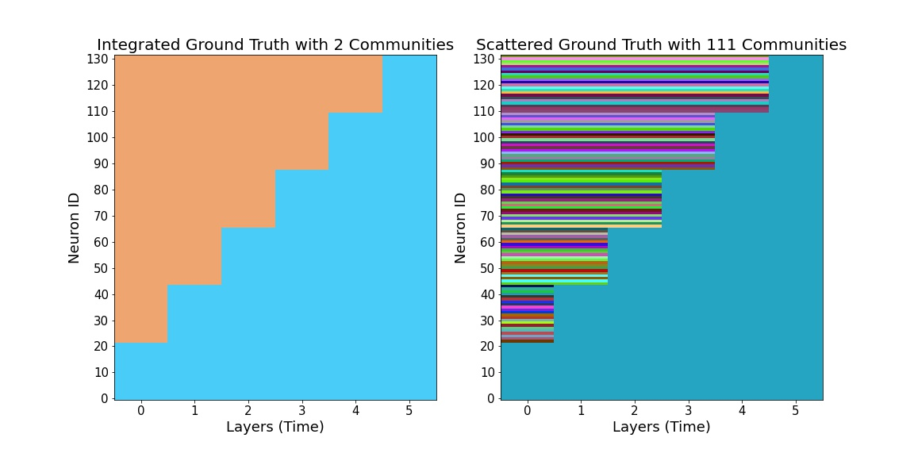
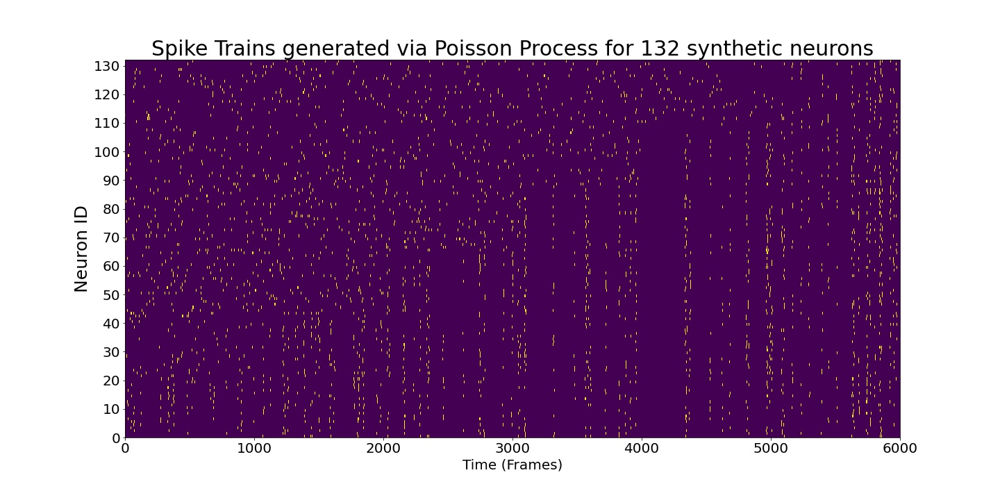
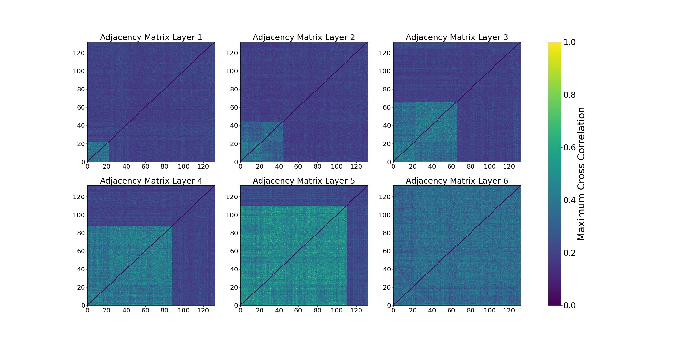

Generating time series of spiking neurons
============================================
One can use the below framework to create time series of spiking neurons which are synchronized in various assymblies. This behavior is exhibited as planted community structure. Note that this package allows simulation of different community events which can be found in The ``Temporal Network`` class.

Planting dynamic communities into synthetic time series data
*************************************************************
We are going to simulate a growing community evolution scnerio in which one community keeps expanding over time.

.. code-block:: python

    #### Inputs
    fixed_size = int(abs(np.random.normal(30,10))) # choose a fixed number for size of each community
    layers = 6
    num_neurons = fixed_size*layers
    comm_sizes = [fixed_size for i in range(layers)] 
    spike_rates = [int(abs(np.random.normal(20,8))) for i in range(layers)]
    display_truth(comm_sizes, community_operation = 'grow')
    

   
   Colors indicate different community labels in a community expansion scnerio. In the left panel, we consider neurons that aren't part of any communities as a one big community which is lumped together, whereas in the right panel, we assign a unique community label for each neuron that they keep belong until they join the expanding community over time.
   

We then create associated time series by planting in dynamic communities determined by the above parameters. We jitter a master spike randomly in order to create communities. We also choose a window size at which a community event will happen.
    
.. code-block:: python

    window_size = 1000 # size, in frames, each adjacency matrix correspond to. better to be equal to bin_size 
    k = 5 #parameter for jittering the spikes
    
    spike_rates = [int(abs(np.random.normal(20,8))) for i in range(layers)]
    
    spikes = create_time_series('grow', comm_sizes, spike_rates, windowsize = window_size, k = k)
    

   
   Spike train generated by Poisson process with planted community structure.
   
   
We bin the spikes into time-windows and compute positive maximum cross-correlation. We choose our bin size equal to window size to capture community events properly. We also multiply the spike trains with a gaussian kernel to maximize the correlation.

.. code-block:: python
    adjacency_matrices = []
    standard_dev = 1.2 # for gaussian kernel
    binned_spikes = bin_time_series(spikes, window_size, gaussian = True, sigma = standard_dev)
    
    for i in range(layers):
        adjacency_matrices.append(cross_correlation_matrix(binned_spikes_G_ESCR[i-1])[0])

   
   Resulting adjacency matrices for each snapshot. 
   
   